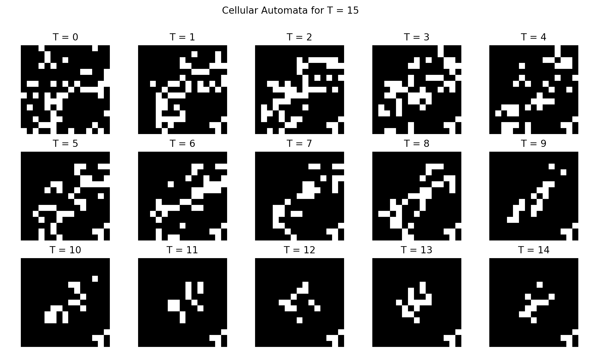
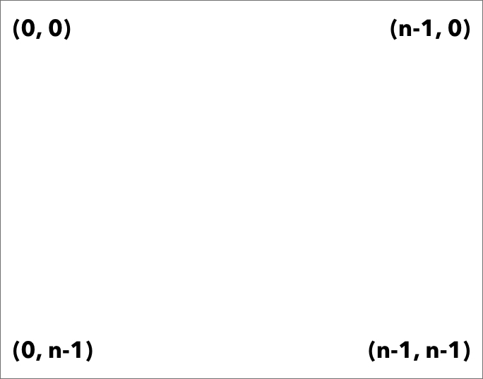

<p align="center">
    <h1 align="center">⚓️ Hringhorni</h1>
    <p align="center">A library for Cellular Automaton simulation made by <strong><a href="http://rish-16.github.io">Rishabh Anand</a></strong></p>
</p>

<p align="center">
    
</p>

---

## Usage

To run a Cellular Automaton simulation, you first create a grid using the `Hringhorni` object of dimensions `n*n`:

```python
from hringhorni import Hringhorni

my_grid = Hringhorni(n=15)
```

You can initialise the grid with randomly chosen points too:

```python
from hringhorni import Hringhorni

my_grid = Hringhorni(n=15)
my_grid.random_spawn(n_cells=30) # default is 10
```

You can even specify the points on the grid you want live cells at. Follow this diagram for reference:



```python
from hringhorni import Hringhorni

my_grid = Hringhorni(n=15)

# using 0-indexing for both horizontal and vertical coordinates
all_points = [[3, 3], [2, 4], [1, 10], [0, 7]] 
my_grid.populate(all_points)

# ensure the points in your array are within the limits of your gride size `n`
```

---

## Traversing Timesteps

To move from one state to another, you can use the `step` method. It returns a `numpy.ndarray` representation of the next board state after the birth/death rules are applied cell-by-cell.
<br>
<br>
Ideally, use this method in a loop (like `for` or `while`) over `T` timesteps:

```python
from hringhorni import Hringhorni

my_grid = Hringhorni(n=15)
my_grid.random_spawn(n_cells=30)
T = 15

for i in range(T):
    next_state = my_grid.step()
```

---

## State Visualisation

There are several methods to obtain or view the grid's current state.

<details>
<summary><code>.display()</code></summary>

This prints out grid to terminal using `0` for dead cells and `255` for alive cells

```python
from hringhorni import Hringhorni

my_grid = Hringhorni(n=15)
my_grid.random_spawn(n_cells=50)
my_grid.display()

"""
0  0  0  0  0  0  0  0 255 0  0  0  0 255 0 
255 0  0 255 0  0  0 255 0  0  0 255 0  0  0 
0  0  0  0 255 0  0  0  0  0  0  0  0  0  0 
0 255 0  0  0  0 255 0  0  0  0  0  0  0  0 
0 255 0  0 255255255 0  0  0 255 0 255 0 255
0  0  0 255 0  0  0 255 0  0  0  0  0 255 0 
0 255 0  0  0  0 255255 0 255 0  0  0  0 255
0  0 255 0  0  0 255 0  0  0  0 255 0  0  0 
0 255 0 255255 0 255 0  0  0  0  0  0  0 255
0  0  0  0 255 0 255 0  0  0  0  0  0  0  0 
0 255 0  0 255 0  0 255 0 255 0  0  0  0  0 
0  0  0  0  0  0  0  0  0  0 255 0  0 255 0 
0 255255 0  0  0  0 255 0  0  0  0 255 0  0 
255 0  0  0  0  0 255255 0  0  0 255 0  0  0 
0  0  0 255255 0  0  0  0  0  0  0  0  0  0
"""
```
</details>

<details>
<summary><code>.raw_obs()</code></summary>

Returns a `numpy.ndarray` object of the current grid state

```python
from hringhorni import Hringhorni

my_grid = Hringhorni(n=15)
my_grid.random_spawn(n_cells=30)
s_0 = my_grid.raw_obs()

# this saves a numpy array representation of the current grid state
```    
</details>

<details>
    <summary><code>.tstep_display()</code></summary>
    
Shows a collective plot of all states across all timesteps like [this](./assets/pic1.png). 
<br>
<br>
Arguments:

1. `frames`: list of states (in in `numpy.ndarray` representation from the `.raw_obs()` method)
2. `r`: number of rows in the plot
3. `c`: number of columns in the plot

> **Note:** Ensure that `r * c = T`, where `T` is the total number of states in `frames` (ie. timesteps)

```python
from hringhorni import Hringhorni

my_grid = Hringhorni(n=15)
my_grid.random_spawn(n_cells=30)
s_0 = my_grid.raw_obs()
all_states = [s_0] # starting with initial state at T=0

T = 15
for i in range(T)
    state = grid.step()
    all_states.append(state)

grid.tstep_display(all_states)
```    
</details>

---

## License

[MIT](https://github.com/rish-16/Hringhorni/blob/master/LICENSE)